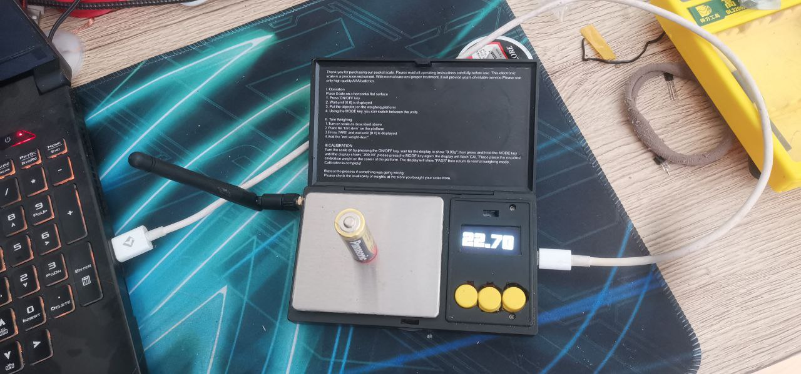
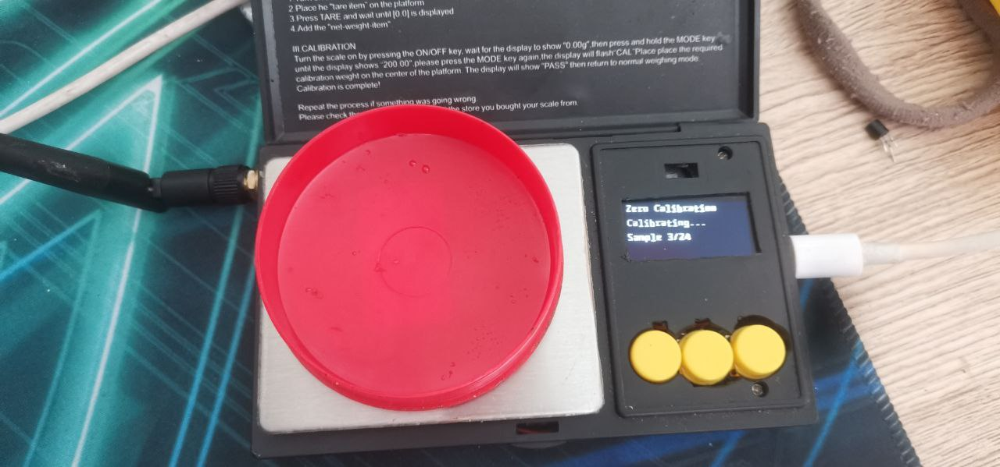

# ESPHome Weight Scale Project

This project implements a high-precision weight scale using ESPHome on an ESP32-C3 microcontroller. The scale measures weight using an HX711 load cell amplifier and displays the readings on an OLED display. It also supports calibration, tare functionality, and integrates with Home Assistant for remote monitoring.

## Table of Contents

- [Features](#features)
- [Hardware Requirements](#hardware-requirements)
- [Circuit Diagram](#circuit-diagram)
- [Installation](#installation)
- [Calibration](#calibration)
- [Developer Mode](#developer-mode)
- [Home Assistant Integration](#home-assistant-integration)
- [Troubleshooting](#troubleshooting)
- [License](#license)

## Features

- **High-Precision Weight Measurement**: Uses HX711 load cell amplifier for accurate readings.
- **OLED Display**: Shows weight in grams on a 128x64 SH1106 OLED display.
- **Calibration Modes**: Supports zero calibration and 100g weight calibration for accuracy.
- **Tare Functionality**: Allows resetting the zero point to accommodate containers.
- **Spike Filtering**: Implements spike detection to filter out erroneous readings.
- **Developer Mode**: Provides additional sensor data and debugging information on the display.
- **Home Assistant Integration**: Publishes weight data to Home Assistant via ESPHome API.
- **Wi-Fi Connectivity**: Supports Wi-Fi configuration and fallback hotspot mode.

## Hardware Requirements

- **Microcontroller**: Seeed XIAO ESP32-C3
- **Load Cell**: Compatible with HX711 amplifier
- **HX711 Load Cell Amplifier**
- **OLED Display**: SH1106 128x64 I2C OLED display
- **Tactile Button**: For tare and calibration functions
- **Resistors**: For button pull-up configuration if needed
- **Miscellaneous**: Wires, breadboard or PCB, and power supply

## Circuit Diagram


*(Include a schematic diagram showing how to connect the load cell, HX711, OLED display, button, and ESP32-C3.)*

## Installation

1. **Clone the Repository**:

   ```bash
   git clone https://github.com/yourusername/esphome-weight-scale.git
   cd esphome-weight-scale
   ```

2. **Install ESPHome**:

   Ensure you have [ESPHome](https://esphome.io/) installed. You can install it via pip:

   ```bash
   pip install esphome
   ```

3. **Configure Wi-Fi Credentials**:

   Edit the YAML configuration file to set your Wi-Fi SSID and password:

   ```yaml
   wifi:
     ssid: "Your_SSID"
     password: "Your_Password"
   ```

4. **Compile and Upload**:

   Connect your ESP32-C3 to the computer and run:

   ```bash
   esphome run weight_scale.yaml
   ```

   Follow the prompts to upload the firmware.

## Calibration

Calibration ensures accurate weight measurements. The scale supports two types of calibration:

### Zero Calibration

- **Purpose**: Sets the zero point when no weight is on the scale.
- **How to Perform**:
  1. Ensure the scale is empty.
  2. Press and hold the calibration button for **3 to 6 seconds**.
  3. Release the button when the display shows "Zero Calibration".
  4. Wait for the calibration to complete.

### 100g Calibration

- **Purpose**: Calibrates the scale using a known 100g weight.
- **How to Perform**:
  1. Place a 100g weight on the scale.
  2. Press and hold the calibration button for **6 to 60 seconds**.
  3. Release the button when the display shows "Calibration 100g".
  4. Wait for the calibration to complete.

### Tare Function


- **Purpose**: Resets the current weight to zero, useful when using containers.
- **How to Perform**:
  - Press the calibration button for **less than 3 seconds**.

## Developer Mode

Developer Mode provides additional information on the OLED display, such as raw weight, tare offset, and sample count.

- **Enable Developer Mode**:
  - Via Home Assistant, toggle the "Developer Mode" switch entity.
- **Display Pages**:
  - **Page 1**: Default weight display.
  - **Page 2**: Developer information.

## Home Assistant Integration

The scale publishes weight data to Home Assistant, allowing for remote monitoring and automation.

- **Entities Exposed**:
  - `sensor.weight_in_grams`: Current weight measurement.
  - `switch.developer_mode`: Toggle developer mode.
- **Setup**:
  - Ensure ESPHome integration is added in Home Assistant.
  - The device should appear automatically if on the same network.

## Troubleshooting

- **Inaccurate Readings**:
  - Perform both zero and 100g calibrations.
  - Ensure the load cell is properly connected and not damaged.
- **Spike Detection Warnings**:
  - Check for loose connections causing unstable readings.
  - Ensure the power supply is stable.
- **Wi-Fi Connectivity Issues**:
  - The device will create a fallback hotspot named "Dummyscales Fallback Hotspot" if it can't connect to Wi-Fi.
  - Connect to the hotspot to reconfigure Wi-Fi settings.

## License

This project is licensed under the MIT License. See the [LICENSE](LICENSE) file for details.

---

**Note**: This project requires a basic understanding of electronics and ESPHome configurations. Handle all electronic components with care and double-check all connections before powering the device.
